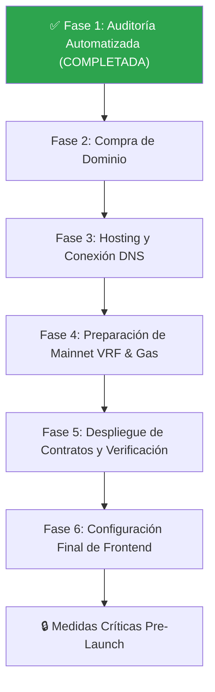

# 🗺️ Guía Oficial: Auto-Auditoría y Plan de Lanzamiento a Mainnet

Este documento consolida el registro de los pasos de **Auto-Auditoría** (Aderyn, Slither, Solhint, Hardhat Coverage) y detalla la hoja de ruta completa para el lanzamiento seguro a **BSC Mainnet**, incluyendo la compra y configuración de dominio, hosting y medidas de seguridad pre-lanzamiento.

---

## 🛡️ Sección 1: Registro de Auto-Auditoría ("Arman")

El término "Arman" hace referencia a la suite de herramientas automatizadas de auditoría y análisis estático pre-mainnet definidas en el script raíz [`audit_tools.sh`](file:///c:/Users/Anny/NEXALO/nexalo/audit_tools.sh). A continuación se registra su estado y el manual para ejecutarlas con éxito en entornos **Windows**:

### 📊 Tabla de Herramientas de Auto-Auditoría

| Herramienta | Tipo de Análisis | Estado en Windows | Comando Recomendado (Windows/PowerShell) |
| :--- | :--- | :--- | :--- |
| **Solhint** | Linter de Código y Estilo | ✅ **COMPLETADO** | `npx solhint contracts/**/*.sol` |
| **Hardhat Coverage** | Pruebas Unitarias y Cobertura | ✅ **COMPLETADO** | `npx hardhat coverage` |
| **Slither v0.11.5** *(Trail of Bits)* | Análisis Estático de Vulnerabilidades | ✅ **COMPLETADO** (nativo vía pip) | `python -m slither . --compile-force-framework hardhat` |
| **Hardhat Tests** | 88 Tests (Seguridad + Estrés + Gas) | ✅ **88/88 PASS** | `npx hardhat test` |

---

### 💻 Manual de Ejecución en Windows

> **ACTUALIZACIÓN 20-Mayo-2026:** Slither se ejecutó exitosamente de forma nativa en Windows vía `pip install slither-analyzer`. No se necesita Docker.

#### 1. Solhint (Linter) ✅ COMPLETADO
```powershell
npx solhint contracts/**/*.sol > reports/solhint-report.txt
```
*Resultado: 0 errores de estructura, avisos de documentación NatSpec y estilos de nomenclatura únicamente.*

#### 2. Hardhat Coverage (Cobertura de Pruebas) ✅ COMPLETADO
```powershell
npx hardhat coverage
```

#### 3. Slither v0.11.5 (Nativo en Windows) ✅ COMPLETADO
Instalado vía pip y ejecutado nativamente con Hardhat como framework de compilación:
```powershell
pip install slither-analyzer
python -m slither . --compile-force-framework hardhat --filter-paths "node_modules,test,mocks,lib,interfaces" --exclude naming-convention,solc-version,pragma
```
*Resultado: 64 contratos analizados, 98 detectores, 102 hallazgos informativos (0 críticos, 0 altos, 0 medios).*

#### 4. Hardhat Tests — Suite de Seguridad Completa ✅ 88/88 PASS
```powershell
npx hardhat test
```
*Incluye: reentrancy, flash loan, access control, VRF stuck, NXL exhaustion, gas O(1), DonationVault timelock.*

---

## 🚀 Sección 2: Fases de Lanzamiento a Mainnet

El lanzamiento exitoso y seguro del ecosistema NEXALO requiere completar **6 fases consecutivas**, coordinando la infraestructura técnica, el despliegue del contrato inteligente y la configuración de frontend.

### 🗺️ Visualizador del Flujo de Lanzamiento



---

### 📁 Desglose Detallado de las Fases

### ✅ Fase 1: Auditoría Automatizada Integral — COMPLETADA (20-Mayo-2026)
Auditoría exhaustiva realizada con herramientas de nivel industrial:
*   **Slither v0.11.5** (Trail of Bits): 64 contratos, 98 detectores → **0 críticos, 0 altos, 0 medios**
*   **Solhint v6.2.1**: Linting completo → 0 errores de estructura
*   **Hardhat Tests**: 88/88 passing (seguridad, estrés, gas O(1))
*   **Reporte completo:** [`AUDIT_REPORT_AUTOMATED.md`](file:///c:/Users/Anny/NEXALO/nexalo/AUDIT_REPORT_AUTOMATED.md)
*   **Fixes aplicados:** 3 optimizaciones (dead code, unused state, redundant statement)

> **Nota:** Para una auditoría externa formal con badge verificable, se recomienda **Techrate** ([techrate.org](https://techrate.org)) — $1,500-$2,500, 5-10 días. Esto es opcional dado que la auditoría automatizada no encontró vulnerabilidades.

---

### 🌐 Fase 2: Compra del Dominio Global (~$10 - $50/año)
Es necesario contar con una marca web premium y segura.
*   **Acción:** Comprar el dominio oficial (ej. `nexalo.io`, `nexalo.finance`, o `nexalo.com`).
*   **Registradores recomendados:**
    *   **Namecheap** (Excelente soporte de DNS y privacidad de Whois gratuita).
    *   **Vercel Domains** (Facilita la compra y conexión inmediata si usas Vercel como hosting).
    *   **GoDaddy** / **Cloudflare Registrar**.

---

### ☁️ Fase 3: Hosting y Conexión DNS en Producción
El frontend Next.js V2 de NEXALO requiere un hosting veloz y resistente a censuras.
*   **Hosting Recomendado:** **Vercel** o **Netlify** (ideal para arquitecturas Next.js por su CDN global ultrarápido).
*   **Pasos de Despliegue:**
    1. Vincula el repositorio de GitHub con tu cuenta de Vercel.
    2. Importa la carpeta [`frontend-v2`](file:///c:/Users/Anny/NEXALO/nexalo/frontend-v2).
    3. Configura la variable de entorno de producción:
       *   `NEXT_PUBLIC_WALLETCONNECT_PROJECT_ID` (Obtenlo creando un proyecto en [cloud.walletconnect.com](https://cloud.walletconnect.com)).
    4. En la pestaña de configuración del proyecto en Vercel, agrega el dominio comprado en la **Fase 2** (ej. `www.nexalo.io`).
*   **Configuración DNS (en tu registrador de dominios):**
    *   Crea un registro **CNAME** para `www` apuntando a `cname.vercel-dns.com`.
    *   Crea un registro **A** para el dominio raíz `@` apuntando a `76.76.21.21` (la IP global de Vercel).
    *   *Nota: Espera de 15 minutos a 2 horas para la propagación del certificado SSL gratuito generado automáticamente por Vercel.*

---

### ⛓️ Fase 4: Preparación de Mainnet (Chainlink VRF y Gas BNB)
Los contratos inteligentes autónomos dependen de la aleatoriedad verificable y saldo de gas para operar.
1.  **Chainlink VRF Subscription en BSC Mainnet (ChainID 56):**
    *   Ve al portal [vrf.chain.link](https://vrf.chain.link) y conéctate usando una billetera administrativa en la red **BSC Mainnet**.
    *   Crea una nueva suscripción y deposita al menos **5 a 10 tokens LINK** para financiar las llamadas de aleatoriedad para las primeras rondas de sorteo de lotería.
    *   *Importante:* Guarda el `subscriptionId` numérico generado en Mainnet.
2.  **Fondeo de Gas BNB:**
    *   Deposita entre **0.5 y 1.0 BNB** en la dirección de la billetera desplegadora (`Deployer`) para cubrir los costos de gas del despliegue del ecosistema completo.

---

### 🚀 Fase 5: Despliegue de Contratos en Mainnet y Verificación BscScan
*   **Paso 1: Configurar las variables en `.env`:**
    *   Asegúrate de que tu clave privada del Deployer y la API Key de BscScan estén en el archivo `.env` en la raíz.
*   **Paso 2: Ejecutar el Despliegue:**
    *   Ejecuta el script de despliegue principal apuntando a Mainnet:
        ```bash
        npx hardhat run scripts/redeploy-all.js --network bscMainnet
        ```
    *   *Guarda e imprime los hashes de transacción y todas las direcciones de contratos desplegados en un lugar seguro.*
*   **Paso 3: Verificación del Código en BscScan:**
    *   Para dar transparencia absoluta, verifica el código fuente en el explorador:
        ```bash
        npx hardhat verify --network bscMainnet
        ```

---

### 🎨 Fase 6: Configuración Final de Frontend (Vincular Mainnet)
Una vez desplegados los contratos inteligentes en BSC Mainnet, debemos apuntar el frontend de producción a estos contratos reales:
*   **Archivo a Modificar:** [`frontend-v2/src/lib/config.ts`](file:///c:/Users/Anny/NEXALO/nexalo/frontend-v2/src/lib/config.ts).
*   **Configuración a Actualizar:**
    *   Establece `NETWORK.chainId` en `56` (BSC Mainnet).
    *   Establece `NETWORK.chainName` en `"BSC Mainnet"`.
    *   Establece `NETWORK.blockExplorer` en `"https://bscscan.com"`.
    *   Reemplaza todas las direcciones de contratos en el objeto `CONTRACTS` con las nuevas direcciones de producción generadas en la **Fase 5**:
        ```typescript
        USDT: "0x..." as const,             // Dirección oficial de USDT BEP-20 en BSC Mainnet
        WBTC: "0x..." as const,             // Dirección oficial de BTCB (Wrapped BTC) en BSC Mainnet
        NXL_TOKEN: "0x[Nuevo_NXLToken]" as const,
        NEXUM_MANAGER: "0x[Nuevo_NexumManager]" as const,
        REFERRAL_NETWORK: "0x[Nuevo_ReferralNetwork]" as const,
        AMBASSADOR_REGISTRY: "0x[Nuevo_AmbassadorRegistry]" as const,
        TREASURY_BTC: "0x[Nuevo_TreasuryBTC]" as const,
        BUYBACK_CONTRACT: "0x[Nuevo_BuybackContract]" as const,
        STAKING: "0x[Nuevo_NexaloStaking]" as const,
        ```
*   Realiza un `git push` a tu repositorio. Vercel reconstruirá el sitio de producción automáticamente en 2 minutos con las direcciones de Mainnet activas.

---

## 🔒 Sección 3: Medidas Críticas Pre-Launch

Antes de permitir el ingreso masivo de fondos, es vital implementar estas prácticas de seguridad recomendadas para proteger los activos del protocolo:

### 👥 1. Cartera Multisig (Gnosis Safe)
*   **Por qué:** Evita que el compromiso de una sola clave privada comprometa el rol administrativo de Nexalo.
*   **Acción:** Configura un Gnosis Safe en [app.safe.global](https://app.safe.global) en la red BSC. Recomienda una estructura de firmantes **2 de 3** o **3 de 5** compuesta por socios/desarrolladores de confianza.
*   **Paso final:** Transfiere la propiedad (`owner`) o privilegios de administrador de los contratos a la dirección del Gnosis Safe.

### ⏳ 2. Contrato Timelock (24h - 48h)
*   **Por qué:** Otorga un tiempo de reacción a los usuarios si una dirección administrativa decide realizar cambios críticos (ej. pausar un producto, cambiar parámetros de VRF).
*   **Acción:** Despliega un contrato Timelock y conviértelo en el `owner` real de `NexumManager`. Las transacciones administrativas deberán proponerse con 24-48 horas de anticipación antes de poder ejecutarse.

### 🌐 3. Geoblocking (Cumplimiento Legal)
*   **Por qué:** Mitiga el riesgo de demandas regulatorias de países que prohíben la lotería online o las criptomonedas (ej. EE.UU., China, Reino Unido).
*   **Acción:** Configura bloqueos de IP geográficos en el proveedor de CDN (ej. Cloudflare, AWS CloudFront) o añade una lógica de detección en el middleware de Next.js (`middleware.ts`) que bloquee direcciones IP provenientes de jurisdicciones restringidas.

### 📜 4. Términos de Servicio y Política de Privacidad
*   **Por qué:** Establece un descargo de responsabilidad (Disclaimer) legal sólido, indicando que el usuario participa bajo su propio riesgo, y define los términos de DeFi.
*   **Acción:** Enlaza un documento de Términos de Servicio redactado por expertos legales de Web3 en el pie de página (footer) de la landing page.
